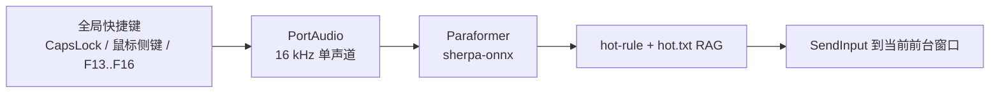

<div align="center">

# VoxPen · 声写

**离线中文语音输入小工具 —— 按住 <kbd>CapsLock</kbd>，说话，松开即输入。**

一个用 C# / .NET 8 / Avalonia 重写的
[HaujetZhao/CapsWriter-Offline](https://github.com/HaujetZhao/CapsWriter-Offline)。

[](LICENSE)
[](https://dotnet.microsoft.com/)
[](#快速开始预编译版)
[](https://avaloniaui.net/)
[](https://github.com/k2-fsa/sherpa-onnx)
[](tests/VoxPen.Core.Tests)

**[English README →](README.en-US.md)**

</div>

---

## 亮点

- **单进程 + 单托盘。** 告别原项目"客户端 + 服务端 + 两个黑色终端窗口"的部署方式 —— 一个 Avalonia 应用安静地待在系统托盘。
- **<kbd>CapsLock</kbd> 一键说话。** 按住录音，松开自动识别并把结果打到当前光标位置。
- **短按保留原始大小写切换语义。** 不足 0.3 秒的短按仍会切换 CapsLock 状态（VoxPen 会自动补发一次按键）。
- **100% 兼容 `hot-rule.txt`。** 正则 / 字面量替换、`\1..\n` 反向引用，行为与原 Python 项目一致 —— 老配置直接迁移即可。
- **音素 RAG 热词。** `hot.txt` 经拼音音素索引做模糊纠正，能修掉常见的同音字识别错误。
- **离线批量转录。** CLI 一条命令把 `.mp3 / .m4a / .wav / .flac / .mp4 / .opus / …` 转成 `.txt / .srt / .json / .merge.txt`。
- **可选的 Markdown 日记。** 每句识别都会连同 WAV 一起归档到 `recordings/YYYY/MM/DD.md`，Typora 里一个正则替换就能变成 `<audio controls>` 内联播放器。
- **热重载。** `config.json` / `hot-rule.txt` / `hot.txt` 修改后 3 秒内自动生效，无需重启。
- **单文件 exe。** `dotnet publish` 产出一个自包含的 `~100 MB` 可执行文件，用户只需自备模型目录。

> **当前状态：** Windows 10/11 x64 · v2 P7（P1–P7 完成）。macOS / Linux 的抽象层已在 `VoxPen.Core` 内就位，具体实现是下一阶段。

---

## 结构一览



---

## 路线图

| 阶段 | 内容 | 状态 |
| ---- | ---- | :--: |
| P1 | 骨架 + Core 抽象接口 | ✅ |
| P2 | PortAudio + Paraformer 端到端（RTF ≈ 0.09） | ✅ |
| P3 | SharpHook `CapsLock` + `SendInput` 上屏 | ✅ |
| P4 | Avalonia 托盘 UI + 状态 / 历史 / 日志面板 | ✅ |
| P5 | `hot-rule.txt` + 末尾标点 + JSON 热重载 + 录音归档（后处理 10/10 通过） | ✅ |
| P6 | `dotnet publish` 单文件（~53 MB） | ✅ |
| P7 | 文件批量转录 · 音素 RAG · 鼠标侧键 · Toast · Markdown 日记 · xUnit（122 tests） | ✅ |
| P7 收尾 | HotRule 复制修复 · `hot-rule.txt` 随 publish · `verify-p7` 冒烟 | ✅ |

**下一阶段（v2 规划）：** LLM 润色 / 角色系统 · UDP 广播 · Fun-ASR / Qwen3-ASR 引擎 · macOS / Linux 平台实现 · 繁体中文 & Chinese ITN。

---

## 快速开始（预编译版）

1. **下载最新 Release** —— 从 [Releases](../../releases) 页拿到 `VoxPen-win-x64.zip` 并解压到任意目录（例如 `D:\Apps\VoxPen\`）。
2. **下载 Paraformer 模型**（约 229 MB）。推荐：原项目预打包的 [HaujetZhao/CapsWriter-Offline releases · models](https://github.com/HaujetZhao/CapsWriter-Offline/releases/tag/models) 里的 `Paraformer.zip`（含国内网盘镜像，SHA-256 `a12a3f97...`）。上游 [k2-fsa/sherpa-onnx](https://github.com/k2-fsa/sherpa-onnx/releases) 的 `sherpa-onnx-paraformer-zh-2023-09-14` 也可用。
3. **（可选）下载标点模型**（约 278 MB）。Paraformer 本身不输出标点 —— 从 [k2-fsa/sherpa-onnx-releases](https://github.com/k2-fsa/sherpa-onnx/releases/tag/punctuation-models) 拿 `sherpa-onnx-punct-ct-transformer-zh-en-vocab272727-2024-04-12.tar.bz2`（FunASR CT-Transformer 的 ONNX 版）。不放也能跑，但识别结果就没有标点，只有 `hot-rule.txt` 里的"逗号/句号/回车"这类语音关键字仍会生效。
4. **摊平模型目录**放到 exe 同级 `models/` 下。注意：拷进去的是解压后目录**里面的内容**，而不是那个目录本身：

   ```
   D:\Apps\VoxPen\
     ├─ VoxPen.App.exe
     ├─ config.json         ← 首次启动自动生成
     ├─ hot-rule.txt        ← publish 时自动附带；可自由编辑
     └─ models\
        ├─ paraformer\
        │  ├─ model.onnx           (或 model.int8.onnx)
        │  ├─ tokens.txt
        │  └─ …                    (am.mvn / config.yaml / …)
        └─ Punct-CT-Transformer\
           └─ sherpa-onnx-punct-ct-transformer-zh-en-vocab272727-2024-04-12\
              ├─ model.onnx
              └─ …                 (tokens.json / etc.)
   ```

5. **双击 `VoxPen.App.exe`。** 任务栏右下角出现一个蓝底 "C" 托盘图标；首次模型加载约 2–3 秒。
6. **鼠标点到任意可输入位置，按住 <kbd>CapsLock</kbd> 说话，松开自动上屏。**

---

## 使用

### 快捷键

| 手势 | 行为 |
| ---- | ---- |
| 长按 <kbd>CapsLock</kbd> ≥ 0.3 秒 | 录音，松开识别并上屏 |
| 短按 <kbd>CapsLock</kbd> < 0.3 秒 | 跳过录音；自动补发一次 CapsLock，保留系统切换语义 |
| 长按期间 | 系统 CapsLock 切换被抑制（可在 `config.json` 里关闭） |

### 托盘菜单

- **显示主窗口** —— 状态灯 / 识别历史 / 实时日志
- **暂停 / 继续监听**
- **打开配置文件夹**
- **退出**

### 主窗口

- **识别历史** —— 最近 50 条识别结果，一键复制最新一条
- **设置** —— 编辑模型目录、查看模型有效性、通过下拉框选择并保存快捷键（模型目录与快捷键改动需重启）
- **日志** —— 模型加载、hot-rule 重载、识别错误等事件实时滚动

> 关闭按钮不会退出应用，而是最小化到托盘。真正退出请用托盘菜单或主窗口底部的"退出"按钮。

### `config.json`

首次启动时在 exe 同目录自动生成。字段名沿用原 Python 项目；VoxPen 只是**新增**了 `transcribe / hotword / notification / shortcut.keys / audio.diaryEnabled` —— 老配置无需改动，缺字段自动填默认值。

```json
{
  "shortcut": {
    "key": "caps_lock",
    "keys": ["caps_lock", "x2"],
    "suppress": true,
    "shortPressThresholdSeconds": 0.3
  },
  "audio": {
    "inputDevice": null,
    "saveRecording": true,
    "audioNameLength": 20,
    "diaryEnabled": true
  },
  "asr":     { "engine": "paraformer", "modelDir": "models/paraformer", "numThreads": 2, "provider": "cpu" },
  "punctuation": {
    "modelDir": "models/Punct-CT-Transformer/sherpa-onnx-punct-ct-transformer-zh-en-vocab272727-2024-04-12",
    "numThreads": 2,
    "provider": "cpu"
  },
  "output":  { "mode": "Type", "restoreClipboard": true, "pasteApps": ["WeiXin.exe", "Telegram.exe"] },
  "postprocess": {
    "enableHotRule": true,
    "hotRulePath": "hot-rule.txt",
    "trashPunctuation": "，。,.",
    "trashPuncThreshold": 8,
    "trashPuncApps": ["WeiXin.exe"]
  },
  "transcribe": {
    "segDurationSeconds": 60,
    "segOverlapSeconds": 4,
    "saveSrt": true,
    "saveTxt": true,
    "saveJson": true,
    "saveMerge": false
  },
  "hotword": {
    "enablePhonemeRag": true,
    "hotwordPath": "hot.txt",
    "matchThreshold": 0.85,
    "similarThreshold": 0.6
  },
  "notification": {
    "enabled": true,
    "showOnRecordingStart": false,
    "showOnError": true
  },
  "logLevel": "Information"
}
```

**热重载：** `config.json` / `hot-rule.txt` / `hot.txt` 修改后 3 秒自动生效。快捷键、ASR 模型路径、标点模型路径、日记根目录的改动仍需重启。

**`shortcut.keys` 支持的键名：** 常用键盘键（字母、数字、修饰键、功能键、导航键和标点键）以及 `x1`、`x2`、`mouse_left`、`mouse_right`、`mouse_middle`。数组表示一个组合，必须同时按住其中全部键才会触发。设置页可直接录制组合；单独字母键（如 `a`）会被拒绝，但 `left_ctrl + a` 可以使用。

### `hot-rule.txt`

原项目文件可直接拿来用，无需转换：

```text
毫安时     =      mAh
赫兹       =      Hz
(艾特)\s*(\w+)\s*(点)\s*(\w+)    =     @\2.\4
欧拉玛     =  Ollama
```

- `#` 起始为注释
- 左侧当正则；正则编译失败则视为字面量
- 右侧支持 `\1..\n` 反向引用与 `\s`（空格）

### 录音归档

`config.audio.saveRecording = true` 时，每次识别都会同时写 WAV + 侧车 txt：

```
recordings/2026/07/assets/20260709-223245_你好世界.wav
                                        _你好世界.txt
```

不需要时改成 `false` 即可。

---

## P7 新特性

### 文件批量转录（离线字幕）

把一段 / 多段音频转成 `.txt / .srt / .json / .merge.txt` 四件套。默认 60 秒切片 + 4 秒重叠；`SegmentMerger` 用 SequenceMatcher 在 token 级去重拼接，`SubtitleAligner` 输出标准 SRT 时间戳。

```bash
dotnet run --project src/VoxPen.Cli -- transcribe path/to/audio.mp3 another.wav
# 可选参数：
#   --seg-duration 60   --seg-overlap 4
#   --no-srt --no-json --no-txt --merge
#   --model <dir>
```

支持的输入：`.wav / .mp3 / .m4a / .aac / .wma / .flac / .mp4 / .ogg / .opus`（走 Windows Media Foundation 解码 + 重采样到 16 kHz mono）。

### 音素 RAG 热词（`hot.txt`）

100% 兼容原项目的 `hot.txt` 格式：一行一个热词，支持 `|` 分隔别名（第一项为目标）、`~~~` 后紧跟黑名单窗口词。用 `ToolGood.Words.Pinyin` 抽取声 / 韵 / 调音素序列，锚点扫描 + DP 距离找候选，右到左 splice 替换。

```text
撒贝宁
北大青鸟|beidaqingniao|BDQN
GitHub|吉他不
先|xiān|xian ~~~ 首先 优先 领先
```

默认匹配阈值 0.85（低于则不替换）；相似阈值 0.6 用于 UI 提示。可在 `config.json` 里调，也可直接改 `hot.txt` —— 3 秒热重载。

### 鼠标侧键 + 组合快捷键

`shortcut.keys` 支持任意组合，例如 `["left_ctrl", "left_shift", "a"]` 表示三键必须同时按住才会开始录音。`["caps_lock", "x2"]` 则要求 CapsLock 与鼠标 X2（前进键）同时按住。设置页点击“录制快捷键”后按下组合并全部松开即可录制；为避免正常输入误触，单独字母键不允许保存。

### Toast 通知

识别完成不再弹 Toast（噪音太大）；出错时可通过 `notification.showOnError` 弹错误 Toast。首次触发会自动创建 AUMID 和开始菜单快捷方式（Windows 10 1903+）；旧系统静默降级。

### Markdown 日记

`audio.diaryEnabled = true` 时，每条识别追加写入 `recordings/YYYY/MM/DD.md`：

```markdown
[12:34:56](assets/20260709-123456_你好世界.wav) 你好世界

[12:35:10](assets/20260709-123510_下一句.wav) 下一句
```

首次创建文件时会自动写入 header —— 附一段 Typora 里能一键把音频链接换成 `<audio controls>` 控件的正则替换 Tip。

### xUnit 单元测试套件

```bash
dotnet test tests/VoxPen.Core.Tests/
```

覆盖 SequenceMatcher / SmartSplit / SegmentMerger / SubtitleAligner / SrtWriter / TranscriptJsonWriter / PhonemeExtractor / FastRag / PhonemeCorrector / HotwordFile / HotRuleReplacer / TrashPuncCleaner / DiaryWriter / AudioSegmenter / FileTranscriber，共 **122 test cases 全绿**。

---

## 从源码构建

前置：[.NET 8 SDK](https://dotnet.microsoft.com/download/dotnet/8.0)。

```bash
dotnet build src/VoxPen.App
```

### 打包单文件 exe（Windows）

```bash
# 自动生成开发版本号，便于本地预览发布包
pwsh -File scripts/package.ps1

# 指定正式或预发布版本号
pwsh -File scripts/package.ps1 -Version 0.1.0-rc.1
```

脚本会生成 `VoxPen-<version>-win-x64.zip` 和对应的 `.sha256`，并把未压缩的发布内容放在 `staging/`。未指定版本时会自动使用类似 `0.1.0-dev.20260724153000` 的开发版本号。GitHub Release 使用同一脚本打包。

压缩包内的 `VoxPen.App.exe`（P7 起约 100 MB，P6 时约 53 MB —— 增量来自 NAudio + Toolkit.Uwp.Notifications + ToolGood.Words.Pinyin 等 P7 依赖）自包含 .NET 运行时 + sherpa-onnx / PortAudio / SharpHook / MediaFoundation 全部原生依赖。

publish 目录会自动带上 `hot-rule.txt`；`config.json` 首次运行在 exe 同目录自动生成默认值。用户只需要自己放 `models/paraformer/`。

### CLI 冒烟测试

```bash
# 后处理端到端（HotRule + TrashPunc）
dotnet run --project src/VoxPen.Cli -- test-postprocess

# 标点模型冒烟（会加载 CT-Transformer，需要 models/Punct-CT-Transformer/... 就位）
dotnet run --project src/VoxPen.Cli -- test-punc "你好世界这是一段没有标点的文本"

# 音素 RAG 冒烟（内置样例，不加载模型）
dotnet run --project src/VoxPen.Cli -- test-hotword

# Markdown 日记冒烟（写到临时目录）
dotnet run --project src/VoxPen.Cli -- test-diary

# 段合并冒烟（模拟 3 段重叠文本）
dotnet run --project src/VoxPen.Cli -- test-merger

# 从 WAV 直接识别
dotnet run --project src/VoxPen.Cli -- --file models/paraformer/example/asr_example.wav

# 批量转录
dotnet run --project src/VoxPen.Cli -- transcribe path/to/audio.mp3

# 无 UI 常驻模式（真实 CapsLock 监听）
dotnet run --project src/VoxPen.Cli -- run
```

---

## 项目结构

```
VoxPen/
├─ src/
│  ├─ VoxPen.Core/              抽象接口 · Pipeline 状态机 · 后处理
│  │                            配置 · 归档 · 转录 · 日记 · 音素 RAG
│  ├─ VoxPen.Platform.Windows/  SharpHook · PortAudio · sherpa-onnx · SendInput
│  │                            MediaFoundation · UWP Toast
│  ├─ VoxPen.App/               Avalonia UI · Tray · AppHost（组合根）
│  └─ VoxPen.Cli/               无 UI 冒烟测试 + 批量转录
├─ tests/VoxPen.Core.Tests/     xUnit 测试套件（122 tests）
├─ models/paraformer/           （用户自备，已 gitignore）
├─ models/Punct-CT-Transformer/ （可选标点模型，已 gitignore）
├─ hot-rule.txt                 可选 · 与原项目 100% 兼容（正则替换）
├─ hot.txt                      可选 · 音素 RAG 热词
├─ config.json                  首次启动自动生成
└─ recordings/                  录音归档 + Markdown 日记（可关）
   └─ 2026/07/
      ├─ 09.md
      └─ assets/
```

**Core 抽象接口**（为 macOS / Linux 增量实现预留）：
`IGlobalHotkey · IAudioCapture · ITextOutput · IAsrEngine · IForegroundApp · IAudioDecoder · INotificationService`

---

## 权限与注意事项

- **麦克风。** 首次启动会由 Windows 弹权限请求。
- **SmartScreen。** Release 里的 exe 未做代码签名，首次运行会弹"Windows 已保护你的电脑"。点 **更多信息 → 仍要运行** 即可，之后不再提示。
- **向管理员窗口输入。** 目标窗口以管理员启动时，VoxPen 自身也需以管理员启动才能 SendInput。
- **杀毒软件误报。** 单文件 exe 打包了大量本地 DLL，可能被误报，请加入白名单。

---

## 开发者备忘

### 目录 / 软链陷阱：不要 junction `publish/models` → `models/`

PowerShell `Remove-Item -Recurse` 处理 junction 时会**跟穿**，把目标目录（真的 `models`）里的内容删光；`-Exclude` 只保护 junction 本身，不阻止跟穿。要清理带 junction 的目录，先用 `cmd /c rd <junction>` 拆链，再操作父目录；或者直接 `Copy-Item -Recurse` 拷贝模型（~250 MB，ReFS/SSD 上瞬间完成），从根本避免这个陷阱。

### 首次开箱即用

- `hot-rule.txt` 通过 `VoxPen.App.csproj` 的 `<None CopyToOutputDirectory>` 随 `build` / `publish` 自动带到输出目录。
- `config.json` 由 `AppHost.LoadOrCreateConfig` 首次启动写默认（含 P7 的 `transcribe / hotword / notification` 三节）。
- `hot.txt` 是用户按需自备，不会自动生成。
- 缺 `models/paraformer/` 时启动会 fail-fast 报 `Model directory not found`，并在日志里给出明确路径 —— 不要绕过它。
- 缺标点模型（`punctuation.modelDir` 指向的目录里没有 `model.onnx`）时会静默降级到 `NullPunctuator`：识别结果不加标点，仅在日志里给一条提示，App 本身仍能启动。

### 无 UI / CI 环境变量

- `CAPSWRITER_LOG_FILE=<path>` —— 把 App 的 Emit 日志实时写到文件。
- `CAPSWRITER_AUTO_EXIT_SECS=<n>` —— `n` 秒后自动 shutdown（冒烟专用）。

组合使用可在 CI / 脚本里做启动冒烟验证，示例见 `publish/verify-p7/`。

---

## 致谢

- **[HaujetZhao/CapsWriter-Offline](https://github.com/HaujetZhao/CapsWriter-Offline)** —— 原项目 / 交互设计 / 配置约定。
- **[k2-fsa/sherpa-onnx](https://github.com/k2-fsa/sherpa-onnx)** —— ASR 引擎 + PortAudioSharp2。
- **[TolikPylypchuk/SharpHook](https://github.com/TolikPylypchuk/SharpHook)** —— 跨平台全局键盘 hook。
- **[AvaloniaUI/Avalonia](https://github.com/AvaloniaUI/Avalonia)** —— 跨平台 XAML UI。
- **[ToolGood.Words.Pinyin](https://github.com/toolgood/ToolGood.Words)** —— 拼音 / 音素抽取。

---

## 许可

[MIT](LICENSE)，跟随原项目。
